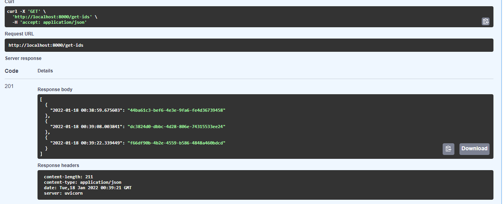

## Cowry Fast

* A simple api built with [FastAPI](https://fastapi.tiangolo.com/) that generates a key value pair containing a timestamp and a uuid and returns this list of all  previously generated key-values when the api endpoint is called.

* This coding assessment is given by [Cowrywise](https://cowrywise.com/)
* please find the source code(s) for this coding assessment [here]() and [here]()

## Sample response

